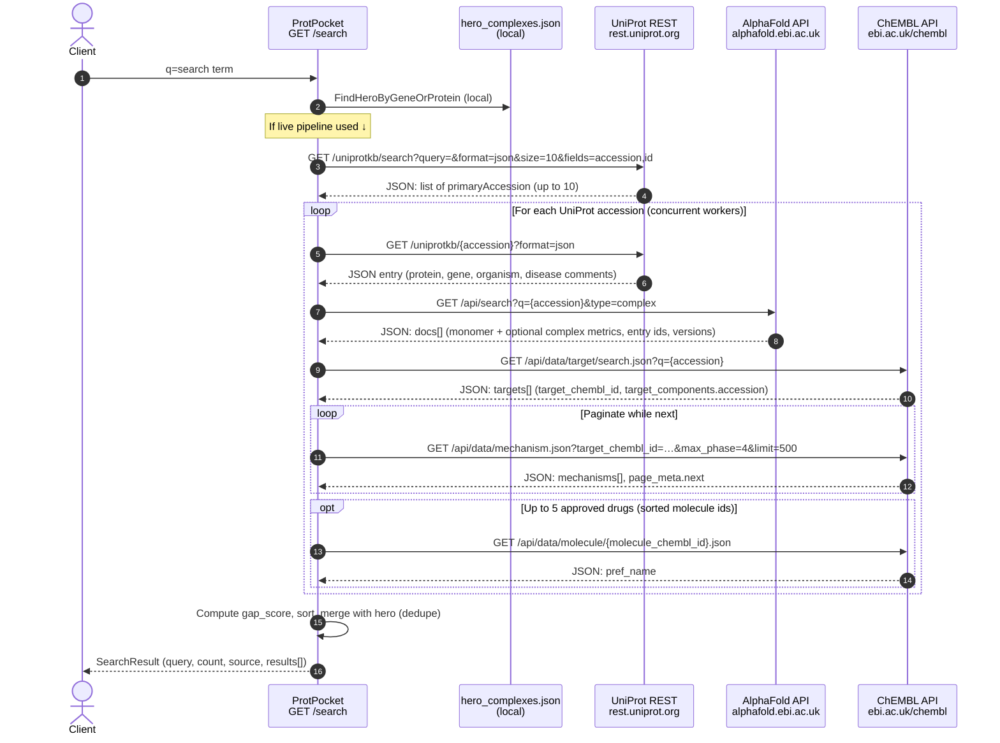

# Search API: live data flow (UniProt, AlphaFold, ChEMBL)

This document describes what happens when **`GET /search?q=…`** runs the **live** path: after a local check against `hero_complexes.json`, the app may call external services. Only **UniProt**, **AlphaFold**, and **ChEMBL** are covered here.

**Per-hit ordering in code** (`handlers/search.go` → `buildComplexFromUniProt`):

1. **UniProt** — resolve candidate accessions from the user query, then load full metadata for each accession.
2. **AlphaFold** — fetch monomer/complex prediction summary for that accession (required: search fails this hit if no monomer).
3. **ChEMBL** — resolve target → count phase‑4 mechanisms → optional molecule names (failures are non-fatal; `drug_count` may be `-1`).

Steps 2–3 are executed **in that order** for each UniProt ID. Multiple IDs are enriched **concurrently** (goroutines), but inside one ID the three backends are called **sequentially**.

---

## Sequence diagram

---

## What is fetched from each API

### 1. UniProt (`https://rest.uniprot.org/uniprotkb`)

| Call | Purpose |
|------|--------|
| **`GET /search?query=…&format=json&size=10&fields=accession,id`** | Map free-text query → up to **10** `primaryAccession` values (`SearchUniProt`). |
| **`GET /{accession}?format=json`** | Load one entry (`FetchUniProtEntry`) for fields used in `models.Complex`. |

**Fields consumed (subset of the JSON):**

- `proteinDescription.recommendedName.fullName.value` → protein name  
- `genes[].geneName.value` → gene name  
- `organism.scientificName`, `organism.taxonId` → organism, NCBI taxon id  
- `comments[]` where `commentType == "DISEASE"` → `disease.diseaseId` (disease associations)  

---

### 2. AlphaFold (`https://alphafold.ebi.ac.uk/api`)

| Call | Purpose |
|------|--------|
| **`GET /search?q={uniprotAccession}&type=complex`** | Find monomer and optional homodimer/complex documents for that accession (`FetchComplexData`). |

**Fields consumed from `docs[]`:**

- Monomer row (`isComplex == false`, `isIsoform == false`): `globalMetricValue`, `entryId` / `modelEntityId`, `latestVersion` → average pLDDT, AlphaFold entry id, **constructed** mmCIF URL  
- Complex row (`isComplex == true`): same pattern → dimer pLDDT, complex CIF URL, `complexPredictionAccuracy_ipTM`  
- Derived: `disorder_delta = max(0, dimerPLDDT − monomerPLDDT)` (if no complex, dimer mirrors monomer, delta `0`)  

If no monomer document exists, **this hit errors** and that accession is dropped from live results.

---

### 3. ChEMBL (`https://www.ebi.ac.uk/chembl/api/data`)

| Call | Purpose |
|------|--------|
| **`GET /target/search.json?q={uniprotAccession}`** | Find ChEMBL targets; pick the one whose `target_components[].accession` matches the UniProt id when possible. |
| **`GET /mechanism.json?target_chembl_id=…&max_phase=4&limit=500`** (paginated via `page_meta.next`) | Approved (phase 4) mechanisms for that target; **distinct** `parent_molecule_chembl_id` (fallback `molecule_chembl_id`) → **`drug_count`**. |
| **`GET /molecule/{molecule_chembl_id}.json`** (up to **5** ids) | `pref_name` for **`known_drug_names`**. |

If ChEMBL calls fail early, the handler still returns a complex with **`drug_count: -1`** and empty names (unknown coverage).

---

## How results are assembled

For each successful accession, ProtPocket merges:

- **UniProt** → identity, naming, organism, diseases  
- **AlphaFold** → pLDDTs, disorder delta, structure URLs, AlphaFold entry id  
- **ChEMBL** → drug count, sample drug names  

Then **`gap_score`** is computed across the batch (needs max drug count among live hits), results are sorted, and **hero** rows are merged without duplicating `uniprot_id` (live wins).

---

*Generated from `handlers/search.go`, `services/uniprot.go`, `services/alphafold.go`, and `services/chembl.go`.*
